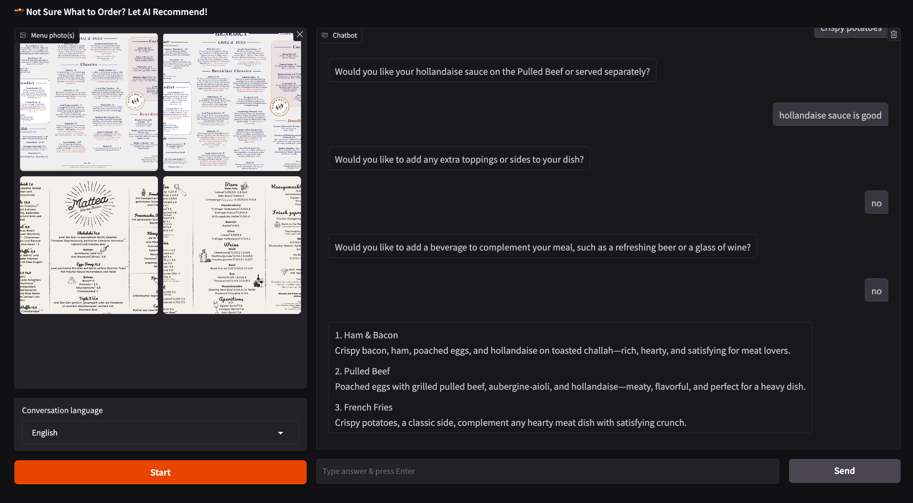
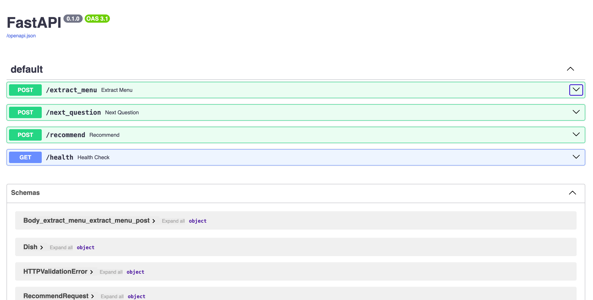

# Menu Analyzer AI

An AI-powered menu analysis and recommendation system that extracts menu items from images and provides personalized dish recommendations based on interactive Q&A.

## Features

- **Menu Text Extraction**: Upload images of restaurant menus to extract dish names, descriptions, and prices.
- **Interactive Recommendation System**: Engage in a Q&A conversation to refine food preferences.
- **Personalized Dish Recommendations**: Receive tailored dish recommendations based on extracted menu items and conversation history.
- **Multi-language Support**: Get recommendations and conduct conversations in different languages.
- **Dual Interface**: Run as either an API server or with a Gradio web interface.

# Example of Gradio UI
 
# Example of Swagger UI
 

## Requirements

- Python 3.12+
- uv package manager

## Installation

1. Clone the repository:

```bash
git clone https://github.com/yourusername/menu-analyzer-ai.git
cd menu-analyzer-ai
```
2. Install uv

Install `uv`, a fast Python package manager:  
Follow the official instructions here: [https://docs.astral.sh/uv/getting-started/installation/](https://docs.astral.sh/uv/getting-started/installation/)

For example, on macOS and Linux:
```bash
curl -LsSf https://astral.sh/uv/install.sh | sh
```

3. Install Project Dependencies

Once `uv` is installed, sync the project environment:
```bash
uv sync
```

4. Setup environment variables:
   - Create a `.env` file with your OpenAI API key:
   ```
   OPENAI_API_KEY=your_api_key_here
   OPENAI_API_MODEL=gpt-4.1-nano  # or your preferred model
   ```

## Running the Application

### Option 1: Run with Gradio Web Interface

```bash
uv run main.py --mode gradio [--port PORT] [--host HOST] [--share]
```

### Option 2: Run as API Server

```bash
uv run main.py --mode api [--port PORT] [--host HOST]
```

## API Endpoints

| Endpoint | Description |
|---------|-------------|
| `POST /extract_menu` | Extract dishes from menu images |
| `POST /next_question` | Generate the next personalized question |
| `POST /recommend` | Get dish recommendations based on preferences |
| `GET /health` | API health check |

See example requests/responses in the API documentation when running the server.

## Testing

Run the test suite:

```bash
# Run all tests
uv run -m pytest
```

### Running Skipped Tests

Some end-to-end API tests are skipped by default. To run these tests:

1. Start the API server in a separate terminal:
   ```bash
   uv run main.py --mode api
   ```

2. Run the tests with the API_BASE_URL environment variable:
   ```bash
   API_BASE_URL=http://localhost:8000 uv run -m pytest tests/test_api_e2e.py
   ```

The test suite includes:
- API endpoint tests
- End-to-end API tests
- LLM wrapper tests
- Validation and environment tests

Mocks are used for external dependencies (OpenAI API, image processing) to ensure tests run without actual API calls.